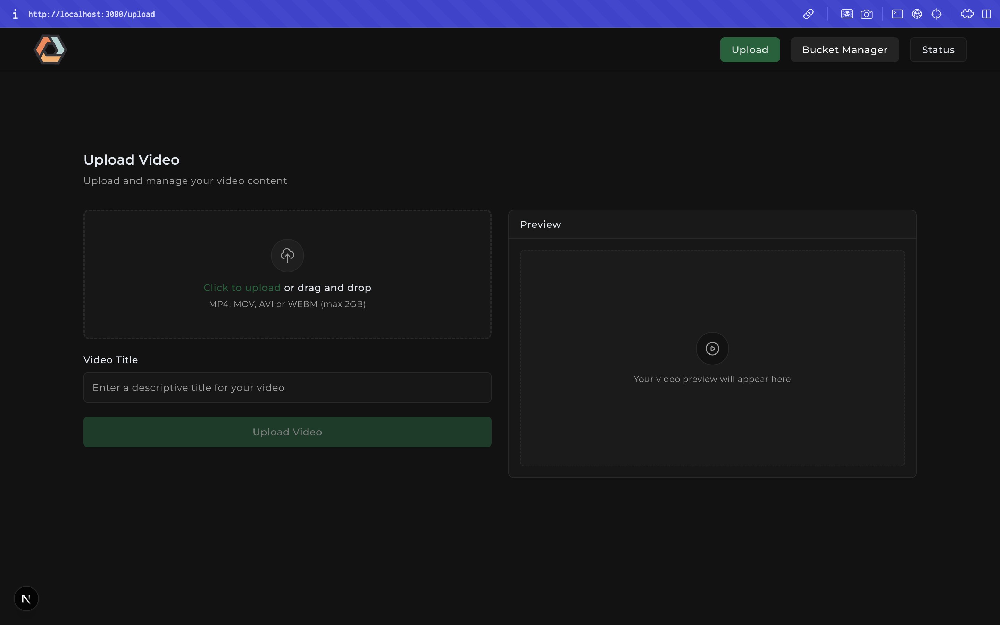
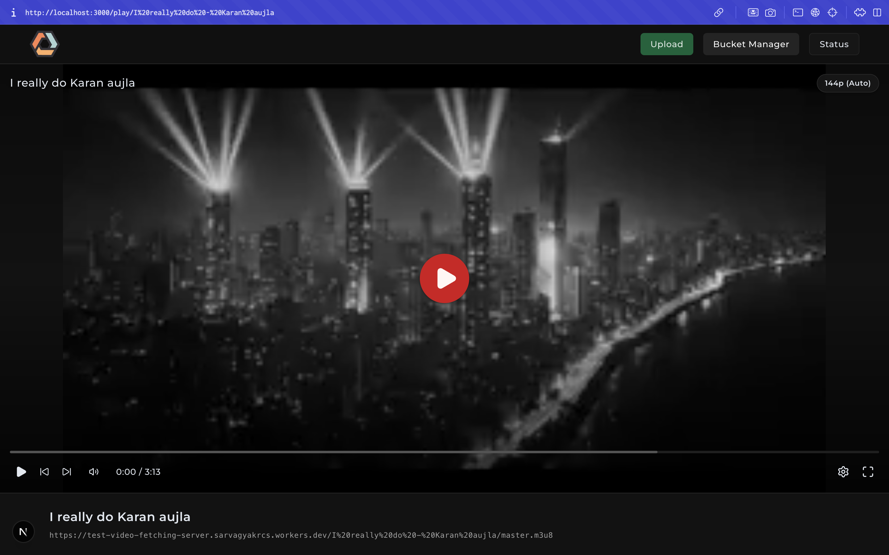
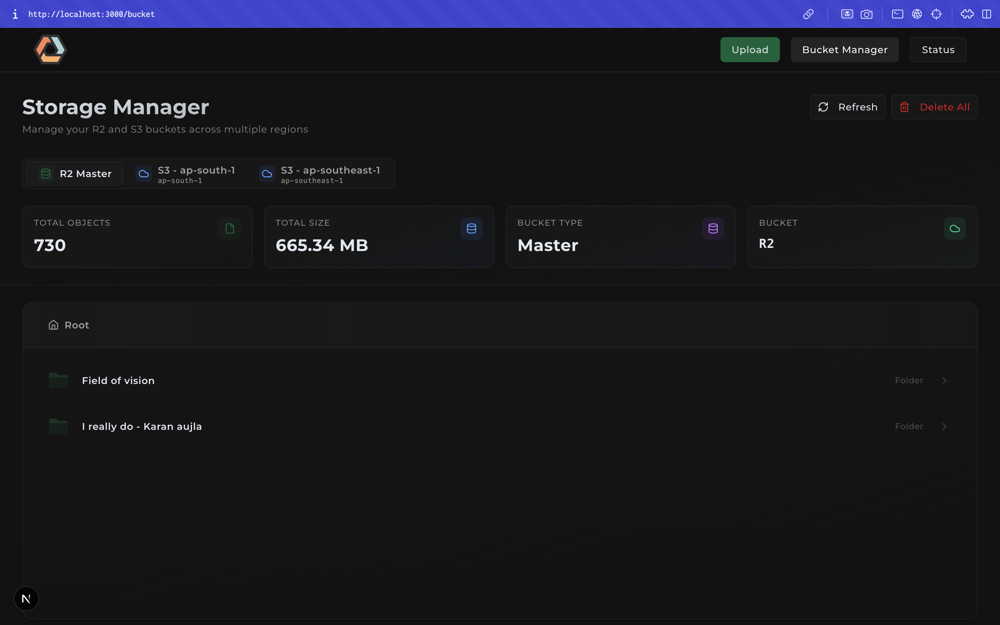

  
  
  # HLS
  
  **HTTP Live Streaming Platform**
  
  A modern video streaming platform built on HLS technology with Cloudflare R2 storage and intelligent video processing capabilities.
  
  
  

---

## Table of Contents

- [Screenshots](#screenshots)
- [Overview](#overview)
- [Architecture](#architecture)
- [Components](#components)
  - [Dashboard](#dashboard)
  - [Upload Server](#upload-server)
  - [Cloudflare Worker Video Fetcher](#cloudflare-worker-video-fetcher)
- [Prerequisites](#prerequisites)
- [Installation and Setup](#installation-and-setup)
  - [Cloudflare Worker Setup](#cloudflare-worker-setup)
  - [Dashboard Configuration](#dashboard-configuration)
  - [Upload Server Configuration](#upload-server-configuration)
- [Running the Application](#running-the-application)
  - [Using the Run Script](#using-the-run-script)
  - [Manual Startup](#manual-startup)
- [Usage](#usage)
- [Technology Stack](#technology-stack)
- [Development](#development)
- [Deployment](#deployment)
- [License](#license)
- [Contributing](#contributing)
- [Support](#support)

---

## Screenshots

### Video Uploader
Upload videos through an intuitive drag-and-drop interface with real-time progress tracking.

### Video Player
Stream HLS content with an integrated player supporting adaptive bitrate streaming.

### Bucket Manager
Manage your R2 bucket contents with an easy-to-use file browser.

---

## Overview

HLS is a video streaming platform built around HLS (HTTP Live Streaming) technology. The platform consists of three primary components working together to provide a seamless video upload, processing, and delivery experience. The system utilizes Cloudflare R2 for object storage and Cloudflare Workers for content delivery from the edge.

The architecture is built with modern web technologies, featuring a Next.js frontend dashboard for video management, a Go-based upload server that handles video processing and transcoding to HLS format, and a serverless Cloudflare Worker that serves video content directly from R2 storage. This approach provides efficient video streaming by converting uploaded videos into HLS segments that can be streamed directly in web browsers.

## Architecture

The HLS platform is composed of three distinct services that work in harmony. The dashboard serves as the user interface where users can upload videos, monitor transcoding status, and manage their media library. The upload server handles receiving video files, transcoding them into HLS format, and storing the processed segments in Cloudflare R2 storage. The Cloudflare Worker serves video content directly from R2 storage to end users, leveraging Cloudflare's edge network for content delivery.

Each component is designed to be independently deployable and maintainable. This separation allows for easier debugging, scaling, and feature development across different parts of the system.

## Components

### Dashboard

The dashboard is a modern web application built with Next.js 16 and React 19, providing an intuitive interface for video management. It features a responsive design powered by Tailwind CSS and Radix UI components, ensuring a consistent user experience across desktop and mobile devices. The dashboard communicates with the upload server for video uploads and the Cloudflare Worker for video playback, utilizing HLS.js for video streaming in the browser.

Users can upload videos through a drag-and-drop interface, monitor transcoding progress, and browse their video library. The application includes a built-in video player that streams HLS content directly from Cloudflare R2 through the worker endpoint.

### Upload Server

The upload server is built with Go and the Gin web framework, offering high-performance video processing capabilities. When a video is uploaded, the server receives the file, validates it, and triggers a transcoding pipeline that converts the source video into HLS format. This process involves segmenting the video into small chunks and generating the necessary playlist files for HLS playback.

The server handles uploads and manages the entire lifecycle of video processing, from initial upload to final storage in Cloudflare R2. It also provides status endpoints that the dashboard can poll to display transcoding progress to users. The transcoding process utilizes FFmpeg, configured with settings optimized for web streaming.

### Cloudflare Worker Video Fetcher

The video fetcher is a serverless Cloudflare Worker built with Hono, a lightweight web framework designed for edge computing. This worker serves video segments and playlists directly from Cloudflare R2 storage. Because Cloudflare Workers run on Cloudflare's global network, users receive video content from the nearest edge location.

The worker sets appropriate cache headers to ensure video segments are cached at the edge for optimal delivery. It also handles CORS headers properly, allowing the dashboard to request video content from a different domain.

## Prerequisites

Before running HLS, ensure you have the following tools and services configured. Node.js version 18 or higher is required for the dashboard and Cloudflare Worker development. Go version 1.21 or higher must be installed for building and running the upload server. FFmpeg should be available in your system PATH as it is used by the transcoding pipeline to process videos.

You will also need a Cloudflare account with R2 storage enabled. R2 provides S3-compatible object storage without egress fees, making it cost-effective for video streaming. Create an R2 bucket through the Cloudflare dashboard and generate API tokens with read and write permissions. These credentials will be used by the upload server and the dashboard to interact with R2 storage.

## Installation and Setup

Begin by cloning the repository to your local machine. Navigate to the project root directory where you will find three main subdirectories corresponding to each component. Each component requires its own configuration and dependency installation.

### Cloudflare Worker Setup

Start by navigating to the cf-worker-video-fetcher directory. Run the package manager installation command to fetch all required dependencies. The worker requires configuration of your R2 bucket binding in the wrangler.jsonc file. Open this file and ensure the MY_BUCKET binding points to your created R2 bucket name. This binding allows the worker to access your R2 storage at runtime.

For local development, use the development command which starts a local server emulating the Cloudflare Workers environment. When you are ready to make your worker accessible to the public, use the deployment command. This will deploy your worker to Cloudflare's edge network and provide you with a public URL. Copy this URL as you will need it for the dashboard configuration.

### Dashboard Configuration

Navigate to the dash-board directory and install all dependencies using your preferred package manager. The dashboard requires environment variables and configuration settings to communicate with other services. Create a .env file based on the provided .env.example template if one exists, or configure the necessary environment variables for your R2 bucket credentials.

Open the config.ts file in the root of the dash-board directory. Update the videoServer URL with the Cloudflare Worker URL you received after deploying the worker. This URL will be used by the video player to fetch video segments. Also ensure the uploadServer URL points to your upload server location, which defaults to localhost:6969 for local development.

### Upload Server Configuration

Navigate to the upload-server directory where the Go server resides. Create a .env file with the necessary configuration variables. At minimum, you need to specify the PORT the server will listen on, typically 6969. Include your R2 bucket credentials including the access key ID, secret access key, bucket name, and region endpoint.

Install the Go dependencies by running the go module download command from the upload-server directory. This will fetch all required packages specified in the go.mod file.

## Running the Application

HLS provides a convenient shell script that orchestrates the startup of all required services. The run.sh script in the project root automates the process of launching both the upload server and dashboard in a coordinated manner.

### Using the Run Script

Make the run script executable if it is not already by changing its permissions. Execute the script from the project root directory. The script will guide you through the setup process with an interactive prompt system.

First, you will be reminded to deploy the Cloudflare Worker and update the dashboard configuration with the worker URL. Next, you will be prompted to confirm that all R2 bucket credentials are properly configured in the respective .env files. Once you confirm these prerequisites by pressing Enter, the script will launch both the upload server and dashboard simultaneously.

The script displays logs from both services in a unified terminal view with color-coded prefixes. Upload server logs appear in amber while dashboard logs appear in purple, making it easy to distinguish between services. The script handles graceful shutdown when you press Ctrl+C, ensuring both services terminate cleanly.

### Manual Startup

If you prefer to run services individually or need more control over the startup process, you can launch each component manually. For the dashboard, navigate to the dash-board directory and start the Next.js development server. This will launch the application on port 3000 by default, accessible at localhost:3000.

For the upload server, navigate to the upload-server directory and run the Go application using the go run command targeting main.go. The server will start on the configured port, typically 6969, and begin accepting video upload requests.

The Cloudflare Worker runs on Cloudflare's infrastructure after deployment, so no local process is needed for production. However, during development, you can run a local worker instance from the cf-worker-video-fetcher directory using the development command.

## Usage

Once all services are running, access the dashboard through your web browser at localhost:3000. The interface presents a clean, modern design with navigation options for uploading videos, viewing your library, and monitoring system status.

To upload a video, navigate to the upload page where you can either drag and drop a video file or click to browse your file system. Select a video file in a common format such as MP4, MOV, or AVI. After selecting your file, initiate the upload process. The dashboard will display a progress bar showing the upload progress to the server.

Once the upload completes, the upload server begins transcoding the video into HLS format. You can monitor this process through the status page in the dashboard. Transcoding time varies based on video length and quality but typically processes faster than real-time playback duration.

When transcoding completes, your video appears in the library. Click on any video to open the built-in player. The player uses HLS.js to stream video content from your Cloudflare R2 bucket through the worker endpoint.

The bucket management page allows you to view all files stored in your R2 bucket, including video segments and playlists. This interface provides options to delete individual files or clear the entire bucket if needed for testing or maintenance purposes.

## Technology Stack

HLS leverages modern web technologies and cloud services to deliver a robust streaming platform. The frontend utilizes Next.js with the App Router for server-side rendering and optimal performance, React for component composition, and TypeScript for type safety. The UI is crafted with Tailwind CSS for utility-first styling and Radix UI for accessible, unstyled component primitives.

Video playback is powered by HLS.js, a JavaScript library that implements HLS protocol in browsers that do not natively support it. Form handling uses React Hook Form with Zod for schema validation, ensuring data integrity. State management and API calls are handled through React hooks and Axios for HTTP requests.

The upload server is built with Go, chosen for its excellent performance characteristics and native concurrency support. The Gin web framework provides a fast HTTP router with middleware support. Video processing relies on FFmpeg, the industry-standard tool for multimedia manipulation, configured to output HLS-formatted streams.

The Cloudflare Worker uses Hono, a small and fast web framework designed for edge computing environments. Hono provides Express-like routing with minimal overhead, perfect for serverless functions. The worker integrates directly with Cloudflare R2 through native bindings, avoiding the need for external API calls.

Storage is provided by Cloudflare R2, an S3-compatible object storage service with zero egress fees. This makes R2 particularly cost-effective for video streaming where users frequently download large video segments.

## Development

When developing new features or fixing bugs, each component can be run in development mode with hot reloading capabilities. The dashboard development server watches for file changes and automatically rebuilds and refreshes the browser. Similarly, the Cloudflare Worker development environment provides instant feedback when modifying worker code.

For the upload server, while Go does not have built-in hot reloading, you can use tools like Air or manually restart the server after making changes. The transcoding scripts located in the shell-scripts directory can be modified to adjust video quality settings or add new transcoding profiles.

Testing video uploads during development is straightforward. Use sample video files of varying lengths and formats to ensure the transcoding pipeline handles different scenarios correctly. Monitor the server logs for any errors during processing and verify that generated HLS manifests are valid.

## Deployment

For production deployment, build and deploy each component to appropriate hosting platforms. The dashboard can be deployed to Vercel, the creators of Next.js, which provides automatic deployments from Git repositories with optimal caching and edge network delivery. Alternatively, deploy to any platform supporting Node.js applications.

The upload server should be deployed to a server or container platform with sufficient resources for video transcoding. Ensure FFmpeg is installed in the production environment with all required codecs.

The Cloudflare Worker deployment is handled through the Wrangler CLI tool using the deployment command. This pushes your worker code to Cloudflare's global network, making it instantly available worldwide. Configure custom domains through the Cloudflare dashboard to provide a branded URL for video delivery.

Ensure all environment variables and configuration files are properly set for production environments. Use secrets management services to store sensitive credentials rather than committing them to version control. Configure CORS policies appropriately to allow your dashboard domain to access the worker endpoints.

## License

This project is licensed under the MIT License. See the LICENSE file for full license text and terms.

## Contributing

Contributions are welcome and appreciated. Please feel free to submit issues for bugs or feature requests. When submitting pull requests, ensure your code follows the existing style conventions and includes appropriate tests where applicable.

## Support

For questions, issues, or discussions about HLS, please open an issue on the project repository. The community and maintainers will assist with troubleshooting and provide guidance for implementation questions.

